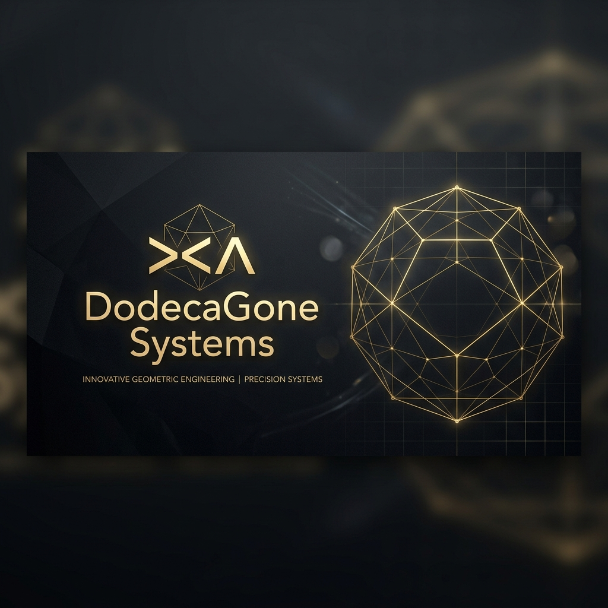

  
  
  <h1>DODECA GONE SYSTEMS</h1>
  
<b>A Unified Hub for Cognitive Orchestration</b>

  

    
    
  

---

### 🏛️ The Flagship Overview
**DodecaGone Systems** is a multi-disciplinary research and development hub for **Cognitive Orchestration**, **Systems Biology**, and **High-Fidelity Knowledge Synthesis**. 

This repository serves as the technical master overview of the entire ecosystem. We treat the human body and mind as integrated hardware. Our tools are designed to reduce cognitive friction, stabilize systems in crisis, and mathematically model lived experience using thermodynamics and category theory.

---

### 🧰 The Toolkit Ecosystem
The DodecaGone framework is divided into specialized open-source toolkits.

| Category | Official Repository | Description |
| :--- | :--- | :--- |
| 🛡️ **Stabilization** | **[You Are Here](https://github.com/DodecaGoneSystems/You-Are-Here)** | Crisis navigation and mechanical grounding. |
| 🧰 **Execution** | **[Maintenance](https://github.com/haskinj/i-need-maintenance)** | Daily/Weekly human hardware manual. |
| 📐 **Logic** | **[Forge Math](https://github.com/DodecaGoneSystems/ForgeMath)** | Formal mathematical framework (Thermodynamics/Category Theory). |
| 📄 **Synthesis** | **[CR-IMRaD](https://github.com/DodecaGoneSystems/CR-IMRAD)** | A unified standard for high-fidelity technical writing. |
| 🗺️ **Topography** | **[Void](https://github.com/DodecaGoneSystems/Void)** | Structural map for dimensional architectural layers. |
| ⚖️ **Relational** | **[Seesaw Theory](https://github.com/DodecaGoneSystems/SeesawTheory)** | Decision mechanics and cascading consciousness. |

---

### 🌱 Core Axioms
`FIDELITY > COMFORT` | `SPIRAL EVER UPWARDS` | `CHIRAL SYMMETRICALITY`

  <code>><^</code> 
  <i>GNU Terry Pratchett</i>

